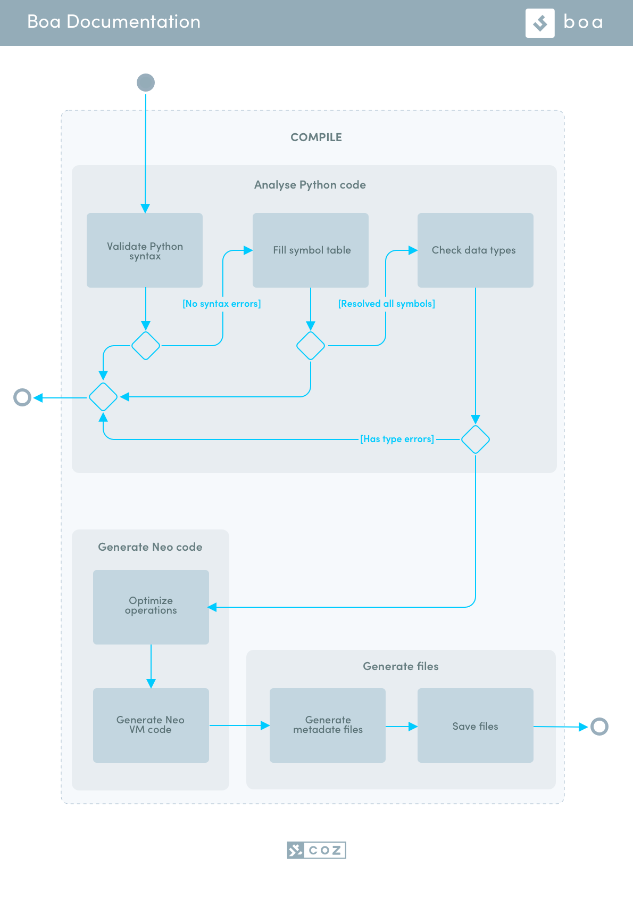

3. Conceptual Overview
######################

This project is part of the **Neo Python Framework**, aimed to allow the full development of dApps using Python alone.

**Neo3-Boa** is a tool for creating **Neo Smart Contracts using Python**. It compiles ``.py`` files to ``.nef`` and ``.manifest.json`` formats for usage in the **Neo Virtual Machine** which is used to execute contracts on the **Neo Blockchain**.

3.1 Project Structure
=====================

Main Execution Flow
-------------------

The diagram bellow shows the basic building blocks of the Neo3-Boa project.

3.2 Product Strategy
====================

.. warning::
    
    **Review this Section:** Also, a link to a dedicated Neo Python Framework page would seem natural.

Pure Python
-----------

We want Python developers to feel comfortable when trying neo3-boa for the first time. It should look and behave like regular Python. For this reason we decided to avoid adding new keywords, but use decorators and helper functions instead.

Neo Python Framework
--------------------

In the real world, simply coding a smart contract is not enough. Developers need to debug, deploy and invoke it. Therefore, it’s important for this tool to be part of a bigger Python framework. To help the developers and avoid a bad user experience, we need to use logs and inform errors with details.

Testing against Neo VM
----------------------

We need to ensure that the code works as expected, and the only way to do that is to run our tests against the official Neo 3 VM. Neo repository already contains a class called TestEngine that is capable of running tests using C# smart-contracts. It will be adjusted to support compiled smart-contracts.

Maintenance
-----------

Create a product that is easy to maintain and upgrade. Use Unit tests, typed and documented code to ensure its maintainability.

3.3 License
===========
Open-source `Apache 2.0`_.

.. _Apache 2.0: https://github.com/CityOfZion/neo3-boa/blob/master/LICENSE.md