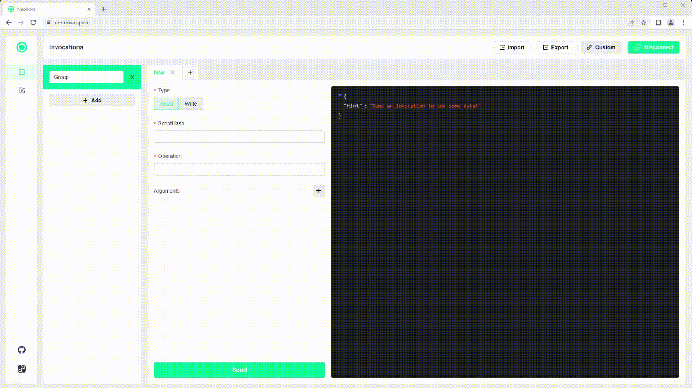

# Invoking smart contracts with Neonova

After writing, compiling and deploying your smart contract locally, you can invoke it using [Neonova](https://www.neonova.space/).

First, connect to your local network by clicking on the top right button next to "Select Wallet", then "Custom" and 
input your local address with the rpc-port and magic number (they should be inside the .neo-express file), and click on
"Save".

If you want to change or add data to the blockchain, you'll also need to connect a wallet to sign your transactions,
click on the "Select Wallet" button, choose one of the platforms and then click on "Connect" (you need to have the app
you chose on your device).

Then, select the "Read" type on the menu if you want to check a value or test an invocation on the blockchain or select
"Write" to persist your invocation on the blockchain, input the script hash of the smart contract you want to invoke, 
the name of the method you want to call and the arguments if the method has any, and click on "Send" to send the 
transaction.

If you did a "Read" invocation, then the result should appear on the right side.

If you did a "Write" invocation, you'll also have the sign the transaction and have enough GAS to pay the fees. On the
right side the transaction id should appear.

